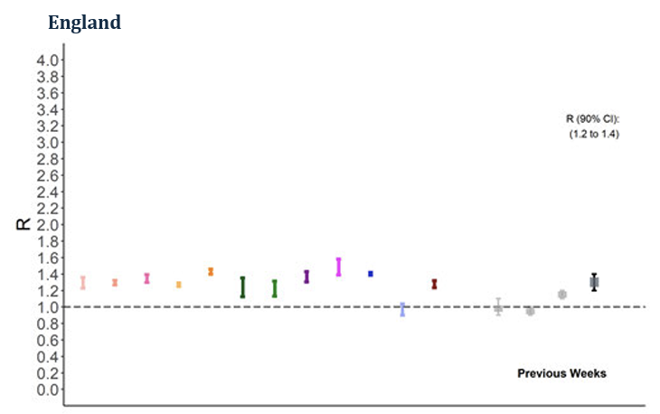

```{r}
#| label: setup
#| include: false
pacman::p_load(here, readr, dplyr, ggplot2)
source(here("R", "process-r-gr.r"))
theme_set(theme_minimal())
```

::: {.callout-note collapse="true"}

## Publication timeline

| Date | Event |
| :--- | :--- |
| 2020 | |
| 29 May 2020 | Government begin publishing the R value on a weekly basis |
| 12 June 2020 | Additional publication of growth rate |
| 10 July 2020 | Reliability indicator introduced^[The reliability indicator showed where estimates were "insufficiently robust to inform policy decisions alone" (Timeseries of R and Growth Rate, Table 1, Note 2). It was based on "daily deaths in a region averaged over a 10-day period... to determine whether it was based on very few cases in a particular area. (Timeseries of R and Growth Rate, Notes and Definitions, Note 7)] |
| 2021 | |
| 26 March 2021 | Update methodology for combining the R values and growth rate: modelling groups now submit a time series of estimates and a given date across all models is used, rather than their most recent estimates |
| 2 April 2021 | Cease estimates for whole- UK R value and growth rate |
| 30 April 2021 | Updated methodology for the reliability indicator^[Updated to: "the number of individuals admitted to hospital with COVID-19 and inpatients newly diagnosed with COVID-19"] |
| 30 April 2021 | Methodology published^[https://www.gov.uk/government/publications/reproduction-number-r-and-growth-rate-methodology] |
| 21 July 2021 | JBC take on responsibility for R and growth rate estimates |
| 6 September 2021 | JBC update published methodology |
| 2022 | |
| 1 April 2022 | UKHSA publish statement of voluntary compliance with the Code of Practice for Statistics^[https://www.gov.uk/government/publications/r-value-and-growth-rate-statement-of-voluntary-compliance-with-the-code-of-practice-for-statistics/reproduction-number-r-and-growth-rate-statement-of-voluntary-compliance-with-the-code-of-practice-for-statistics] |
| 7 December 2022 | Historical estimates of R and growth rate published as single download |
| 23 December 2022 | Cease publication of both R and growth rate |
:::

## Consensus estimates

R and growth rate estimates were published in real time from May 2020.
Between 3-12 modelling groups provided R estimates each week, considered in group discussion, and combined in a simple average.
This was the "consensus estimate".

:::  {.callout-note collapse="true"}

### SPI-M-O R estimates

Each modelling group produced estimates of R and the growth rate, before discussing and comparing across their estimates each week.
All the estimates were combined as the mean average, and rounded to one decimal place. 

> From around May 2020, SPI-M-O began to combine these nowcasts using a statistical approach across a minimum of 3, but often more than 10, models to provide a consensus range... all models have been weighted equally when estimating R
> 

Producing something each week that looked like this: 



A final dataset of all the weekly consensus estimates was published in 2022^[https://www.gov.uk/government/publications/reproduction-number-r-and-growth-rate-methodology], as:

> a time series of contemporary estimates, which were calculated using the data available at the time and do not necessarily represent the current understanding of R and growth rates for those dates. Estimates have not been revised to include new data.^[Timeseries of R and Growth Rate, Note 4]

Published data include lower and upper bound estimates for R and the growth rate per day (90% Confidence Interval), for England and the seven NHS England regions. Here, data were downloaded and lightly [pre-processed](../R/process-r-gr.R).

:::

Looking at just the R and growth rate estimates for England:

```{r}
r_gr <- process_r_gr()
r_gr <- mutate(r_gr, model = "Weekly consensus",
production = ifelse(date < as.Date("2021-07-21"), "SPI-M", "JCB"))

plot_estimates <- function(region, data, value_type = "R") {
    data |>
filter(region == {{region}}) |>
filter(value_type %in% {{value_type}}) |>
mutate(reference = ifelse(value_type == "R", 1, 0)) |>
ggplot(aes(x = date, col = production, fill = production)) +
geom_linerange(aes(ymin = value_lower, ymax = value_upper), alpha = 0.4, lwd=1, col = "#af8dc3") +
geom_line(aes(y = reference), lty=2, col="grey50") +
facet_wrap(~value_type, ncol=1, scales = "free_y") +
labs(x = NULL, y = "Estimate (90% CI)",
title = paste({{region}}, "COVID-19 epidemic indicators")) +
theme(legend.position = "bottom")
}
plot_estimates("England", r_gr)
```

## Retrospective comparison

We don't typically collect data on R directly (as it is an average of transmission chains). 
This makes it difficult to evaluate. 
However, we can compare these real-time estimates against a retrospective "best estimate".
Plotting directly against consensus estimates, using Rt and growth rate from inc2prev:

```{r}
i2p <- read_csv("https://github.com/epiforecasts/inc2prev/raw/refs/heads/main/outputs/estimates_national.csv") 

i2p <- i2p |>
filter(variable == "England") |>
select(date, region = variable, value_type = name, value_lower = q10, value_upper = q90) |>
filter(value_type %in% c("R", "r")) |>
mutate(value_lower = ifelse(value_lower == "r", value_lower*100, value_lower),
value_upper = ifelse(value_upper == "r", value_upper*100, value_upper),
value_type = ifelse(value_type == "r", "growth rate", "R"),
model = "inc2prev")
```

```{r}
r_gr2 <- r_gr |>
rename(value_lower_consensus = value_lower,
value_upper_consensus = value_upper)

comp <- left_join(i2p, r_gr2, by = c("date", "region", "value_type"))

plot_estimates_comp <- function(region, data, value_type = "R") {
    data |>
filter(region == {{region}}) |>
filter(value_type %in% {{value_type}}) |>
mutate(reference = ifelse(value_type == "R", 1, 0)) |>
ggplot(aes(x = date)) +
geom_linerange(aes(ymin = value_lower_consensus, ymax = value_upper_consensus), alpha = 0.4, lwd=1, col = "#af8dc3") +
geom_ribbon(aes(ymin = value_lower, ymax = value_upper), alpha = 0.3, col = "#7fbf7b", fill = "#7fbf7b") +
geom_line(aes(y = reference), lty=2, col="grey50") +
facet_wrap(~value_type, ncol=1, scales = "free_y") +
labs(x = NULL, y = "Estimate (90% CI)",
title = paste({{region}}, "COVID-19 epidemic indicators")) +
theme(legend.position = "bottom")
}
plot_estimates_comp("England", data = comp, value_type = "R")
```

But inc2prev is calculated daily, to 4 d.p. 
To make it a fairer comparison, we can round inc2prev estimates to 1 d.p. and keep only the days that overlap with the consensus.

```{r, eval="false"}
comp_trunc <- comp |>
mutate(
    #across(c(value_lower, value_upper), ~ zoo::rollmean(.x, k=7)),
    across(c(value_lower, value_upper), ~ round(.x, digits = 1))) |>
    filter(date %in% r_gr$date)

plot_estimates_comp("England", data = comp_trunc, value_type = "R")
```

## Evaluation

CMO Report on COVID-19^[https://www.gov.uk/government/publications/technical-report-on-the-covid-19-pandemic-in-the-uk/chapter-5-modelling]:

> ...all models have been weighted equally when estimating R, but other methods of statistical combination might be more appropriate in the future.

## Future work

- Comparison with retrospectively calculated R and GR using latest available methodology and data
    - recalculate weekly, on diff sources
- Comparison with contemporary estimates contributing to the ensemble presented above (e.g. via requesting accesss to CrystalCast)
- Text analysis of interpretation presented in consensus statements from SPI-M and EMRG^[https://www.gov.uk/government/publications/consensus-statements-on-covid-19]

## Appendix

::: {.callout-note collapse="true"}

### Reading

CMO Report on COVID-19^[https://www.gov.uk/government/publications/technical-report-on-the-covid-19-pandemic-in-the-uk/chapter-5-modelling]

:::

::: {.callout-note collapse="true"}

### Source data notes
_Copied from the published data tables_

#### General notes
Estimates for R and growth rates are shown as a range, and the true values are likely to lie within this range.		
Tables 1 and 2 provide a time series of contemporary estimates, which were calculated using the data available at the time and do not necessarily represent the current understanding of R and growth rates for those dates. Estimates have not been revised to include new data.  		
		
From 2 April 2021, UK estimates for the R value and growth rate are no longer produced. Given the increasingly localised approach to managing the epidemic, particularly between nations, UK level estimates are less meaningful than previously, and are more easily biased by the models combined in their calculation. SPI-M considers estimates of the R value and growth rates for the four nations and NHS England regions to be more robust and useful metrics than those for the whole UK.		
		
As of 26 March 2021, the approach to combining the R values and growth rate has been normalised, so that modelling groups now submit a time series of estimates and a given date across all models is used, rather than their most recent estimates. This makes the estimation more consistent and robust, with little to no difference to the range.		
		
When the numbers of cases or deaths are at low levels and/or there is a high degree of variability in transmission across a region, then care should be taken when interpreting estimates of R and the growth rate. For example, a significant amount of variability across a region due to a local outbreak may mean that a single average value does not accurately reflect the way infections are changing throughout that region.		
		
R and growth rates are not the only important measures of the epidemic, and should be considered alongside other measures of the spread of disease. In particular, the number of new cases of the disease identified during a specified time period (incidence), and the proportion of the population with the disease at a given point in time (prevalence). If R equals 1 with 100,000 people currently infected, it is a very different situation to R equals 1 with 1,000 people currently infected. 		
		
As of 30 April 2021, the reliability indicator for estimates has changed. Prior to this date, daily deaths in a region averaged over a 10-day period were used when calculating an estimate's reliability score, to determine whether it was based on very few cases in a particular area. These data were agreed to be the most reliable data stream when the indicator was developed in summer 2020. Over recent months, the number of deaths has been driven down to very low levels due to lockdown and the impact of the COVID-19 vaccination programme, consequently reducing reliability scores for many regions. As a result, the number of individuals admitted to hospital with COVID-19 and inpatients newly diagnosed with COVID-19 have replaced deaths as an indicator for whether the estimate is based on very few cases in a region.

#### Data table notes
1. Estimates for R and growth rates are shown as a range, and the true values are likely to lie within this range.
2. Estimates in red do not meet certainty criteria. Particular care should be taken when interpreting these estimates as they are based on low numbers of cases or deaths and / or dominated by clustered outbreaks. These estimates are insufficiently robust to inform policy decisions alone (applied from 10 July 2020). From 30 April 2021, the methodology for the reliability indicator has changed. Please see point 7 in Notes_and_defintions.
3. * denotes weeks in which estimates may be based on fewer days or lower quality data than usual, due to increased reporting delays and disruption to data streams during bank holidays and the festive period.
4. Dates provided refer to the date of publication
5. Tables 1 and 2 provide a time series of contemporary estimates, which were calculated using the data available at the time and do not necessarily represent the current understanding of R and growth rates for those dates. Estimates have not been revised to include new data.  
6. From 2 April 2021, UK estimates for the R value and growth rate are no longer produced. Given the increasingly localised approach to managing the epidemic, particularly between nations, UK level estimates are less meaningful than previously, and are more easily biased by the models combined in their calculation. SPI-M considers estimates of the R value and growth rates for the four nations and NHS England regions to be more robust and useful metrics than those for the whole UK.
7. As of 26 March 2021, the approach to combining the R values and growth rate has been normalised, so that modelling groups now submit a time series of estimates and a given date across all models is used, rather than their most recent estimates. This makes the estimation more consistent and robust, with little to no difference to the range.
8. When the numbers of cases or deaths are at low levels and/or there is a high degree of variability in transmission across a region, then care should be taken when interpreting estimates of R and the growth rate. For example, a significant amount of variability across a region due to a local outbreak may mean that a single average value does not accurately reflect the way infections are changing throughout that region.
9. R and growth rates are not the only important measures of the epidemic, and should be considered alongside other measures of the spread of disease. In particular, the number of new cases of the disease identified during a specified time period (incidence), and the proportion of the population with the disease at a given point in time (prevalence). If R equals 1 with 100,000 people currently infected, it is a very different situation to R equals 1 with 1,000 people currently infected. 
10. On 22 October, the regional estimates of R and growth rate were paused until we gain a full understanding of the impact of the reported incident of false negative results on estimates in the South West, South East and London
11. On 27 October regional estimates of R and growth rate resumed for all regions except the South West. This is following confidence that the impact of the incorrect negatives is unlikely to materially impact the estimates for regions outside of the South West. Estimates for the South West will remain paused until we gain a full understanding of the impact of the reported incident (the incorrect negative PCR test results) on estimates in this region. However, the UKHSA is confident that R is above 1 in the South West and that the epidemic is growing in this region.
12. On 5 November, the regional estimate of R and growth rate resumed for the South West.  This is following confidence that the incorrect PCR test results are unlikely to have materially impacted on the estimates for this region.
:::	