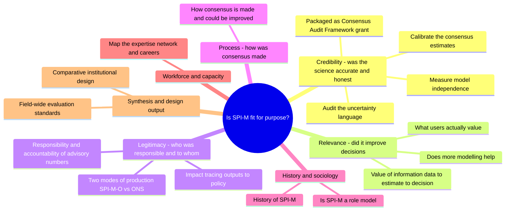

---
format:
  html:
    toc: true
---

# Idea index

Consolidated from three repos --- `kath-a-log`, `spi-m-o`, `applications`.
Overarching question (from `big-picture.qmd`): what is the marginal value of information in emergency epidemic intelligence --- is SPI-M fit for purpose?
Spine is the evaluation triad of credibility (quality) / relevance (value) / legitimacy (trust), plus two cross-cutting themes (history, workforce).

## Mindmap

--------------------------------------------------------------------------------

## Credibility (was the science accurate and honest)

### Calibrate the consensus estimates

- Idea: score how accurate the weekly consensus R / growth-rate estimates were against a retrospective gold standard, and explain the variation.
- Rationale: consensus R was central to UK COVID policy; no external calibration published.
  Inverts McCabe et al 2024 (they asked whether ONS-CIS could recover the consensus; this asks whether the consensus was any good).
- Approach: gov R/growth series (May 2020--Dec 2022) vs `inc2prev` (Abbott & Funk) from ONS-CIS; proper scoring rules (interval score, 90% CI); handle lags/rolling averages; stratify by variant phase, evidence type, contributor count, inter-model agreement.
  Model accuracy as a function of those drivers (triangulate with interviews).
  Fuller designs: value-of-information and decision-impact scoring, re-running contemporary models via CrystalCast; test rounding/combination alternatives (assumption-similarity weighting, Bayesian model averaging).
- Natural experiment: July 2021 handover of Rt aggregation from SPI-M-O to JBC/UKHSA --- accuracy and uncertainty language with group discussion (pre) vs without (post).
- Interpretation: hypothesis that a simple average over variable inputs is more biased than a single model on a consistent data stream.
  Prelim: \~19% of consensus estimates got the trend direction wrong (caveat: ONS-CIS excluded closed settings, so consensus could occasionally beat "truth").
- Folds: former A1, A2, A3, K1.
- Source: [explore-r-gr.qmd](/Users/kathsherratt/Documents/Github/spi-m-o/notebook/pages/explore-r-gr.qmd); `R/process-r-gr.R`; [application-scientific.qmd](/Users/kathsherratt/Documents/Github/applications/nihr/application-scientific.qmd)

### Audit the uncertainty language

- Idea: test whether the probabilistic language in consensus statements was calibrated to the quantitative evidence and internally consistent.
- Approach: code statement PDFs against the PHIA "probability yardstick", IPCC calibrated-uncertainty language, Spiegelhalter's ladder, or GRADE; grep tooling exists (`R/phia-language.R`, `R/parse-pdf.R`); `quanteda`/`widyr` for pairwise statement similarity.
  Does the narrative ("we are confident Rt is...") match the number?
- Interpretation: empirical audit of language--quantity consistency.
  Responds to COVID Inquiry para 9.118 (minutes should state confidence level and drivers of uncertainty).
- Source: [phia-language.R](/Users/kathsherratt/Documents/Github/spi-m-o/R/phia-language.R); [research-map.mm.md](/Users/kathsherratt/Documents/Github/applications/research-map.mm.md)

### How consensus is made and could be improved

- Idea: open the black box of group deliberation, which shapes policy advice yet is almost undocumented.
- Approach: Benchmark SPI-M practice against validated protocols (SHELF/IDEA/DELPHI/SEE) and link deviations to calibration.
- Interpretation: best-practice guidelines (?
  GRADE-like certainty + strength) for producing consensus statements; what AI changes about consensus.

- ### Measure model independence

- Idea: measure genuine diversity among contributing models --- a consensus over redundant models is falsely confident.

- Approach: reconstruct each model's structural assumptions via elicitation; build a per-model DAG for a "genealogy of shared assumptions" (Knutti/Masson); compute a similarity index vs consensus accuracy.
  Calibrate individual components for "internal model discrepancy" (upper bound on value of model improvement).
  Adapt the Harvey-Leybourne-Newbold encompassing test on the model submission archive to separate independent from redundant model pairs.

- Interpretation: taxonomy of error; diversity of methods vs number of models.

- Source: [case-for-support.qmd](/Users/kathsherratt/Documents/Github/applications/nihr/case-for-support.qmd); [research-map.mm.md](/Users/kathsherratt/Documents/Github/applications/research-map.mm.md)

Packaged: Consensus Audit Framework (UK Metascience grant) bundles [Calibrate the consensus estimates](#calibrate-the-consensus-estimates), [Audit the uncertainty language](#audit-the-uncertainty-language), and [Measure model independence](#measure-model-independence) into WP1 corpus calibration + WP2 interviews + WP3 a reusable audit framework transferable to IPCC/WHO/food-safety bodies.
Source: [application-ukms-spim.qmd](/Users/kathsherratt/Documents/Github/spi-m-o/notebook/drafts/application-ukms-spim.qmd)

--------------------------------------------------------------------------------

## Relevance --- did it improve decisions?

### Value of information: data → estimate → decision

- Idea: trace value along the whole chain --- how much each surveillance stream reduced Rt uncertainty, and the mortality cost of decision errors.
- Approach: (data) collate every surveillance source cited in COVID consensus statements (cases, hospitalisations, deaths; ONS-CIS, REACT, CoMix); estimate posterior-uncertainty reduction per stream.
  (decision) systematic review of SPI-M statements 2009--2022 for implied Rt/excess-mortality decision thresholds; trace SPI-M → SAGE → government decisions via Inquiry records; map Rt to excess mortality via age/sex/region IFR.
- Interpretation: surveillance-priority guide for future outbreaks; whether over- or under-reliance carried measurable health costs.
  This is the master "marginal value of information" framing (VOI on two axes: epidemiological vs public-health information), with SPI-M as flagship case study.
- Source: [case-for-support.qmd](/Users/kathsherratt/Documents/Github/applications/nihr/case-for-support.qmd); [big-picture.qmd](/Users/kathsherratt/Documents/Github/kath-a-log/log/big-picture.qmd); [planning-big-picture.md](/Users/kathsherratt/Documents/Github/kath-a-log/log/planning-big-picture.md)

### What users actually value

- Idea: elicit what makes a "good" forecast for the people using it.
- Approach: discrete choice experiment across model characteristics (performance, interpretability, context specificity, known past performance), modeller characteristics (team trust, in-house vs external, modifiability), outbreak characteristics --- how much better must a single model be to beat the ensemble?
  Complement with the "working alliance" (goal/task/bond) model to test whether advice actually changes decision-maker practice.
- Interpretation: reveals attributes of the problem that drive decisions
- Source: [users.qmd](/Users/kathsherratt/Documents/Github/kath-a-log/greenhouse/qual/users.qmd); [research-context.qmd](/Users/kathsherratt/Documents/Github/applications/wellcome-ecr/research-context.qmd)

### Does more modelling help?

- Idea: field-wide review of whether aggregating many models into ensembles improved decision-making.
- Rationale: process factors (onboarding, consensus time, resources) and impact factors (relevance, communication, acceptance) are rarely reported; infrastructure was scaled with almost no evaluation of decision support.
- Approach: European COVID Hub case study; drivers of component performance; decade-long systematic review of multi-model collaborations.
- Interpretation: predictive accuracy is not usefulness; weighs benefits against the costs of collaborative advisory work.
- Source: [EMS-Lugano-abstract-DRAFT.md](/Users/kathsherratt/Documents/Github/kath-a-log/shed/presentations/EMS-Lugano-abstract-DRAFT.md)

--------------------------------------------------------------------------------

## Legitimacy --- who was responsible, and to whom?

### Responsibility and accountability of advisory numbers

- Idea: whether and how SPI-M-O should be held to account for the numbers it produced.
- Approach: treat Medley's three claimed "invaluable" functions (peer review, uncertainty emphasis, shared responsibility) as evaluable claims with risks as well as benefits; map onto OSR "Quality, Value, Trust", the Aqua Book, and the Orange Book "three lines of defence"; analyse how SPI-M's function shifted across those lines and what QA fits each; review OSR casework (4 COVID R requests 2020-21, all "informal discussion"), UKHSA's 2022 voluntary compliance, and government QA codes (Macpherson, BEIS, NAO, Scientific Advisory Committees code); JCVI as routine advice lacking QA.
- Interpretation: suspicion SPI-M is nominally Line 3 (independent review) but operated as Line 2, at times Line 1 (guiding policy via headline R); diffusion-of-responsibility moral hazard.
  Central question: how far should advisory bodies be held to the same account as official statistics?
  Explicit role definition would have reduced both over- and under-reliance.
- Source: [evaluation.qmd](/Users/kathsherratt/Documents/Github/spi-m-o/notebook/pages/evaluation.qmd); [regulation.qmd](/Users/kathsherratt/Documents/Github/kath-a-log/greenhouse/qual/regulation.qmd); [research-map.mm.md](/Users/kathsherratt/Documents/Github/applications/research-map.mm.md)

### Two modes of production: SPI-M-O vs ONS

- Idea: compare a demand-driven, voluntary, ad hoc expert group (SPI-M-O) against a supply-driven, funded, routine producer (ONS excess deaths).
- Rationale: both produce unobservable, lagged, censored, policy-salient estimands; the difference is mode of production.
- Approach: compare on Quality (real-time evaluation, peer review), Value (uncertainty, risk expression), Trust (responsibility allocation); documentary analysis + OSR compliance review.
- Interpretation: comparative case study + institutional design recommendations.
- Source: [rt-excess-deaths.qmd](/Users/kathsherratt/Documents/Github/kath-a-log/greenhouse/general/rt-excess-deaths.qmd)

### Impact tracing: outputs → policy

- Idea: link SPI-M's probabilistic outputs to documented policy influence.
- Approach: database of probabilistic statements cross-referenced against the Inquiry witness-statement corpus; trace membership's work via ORCID; policy use via Hansard, FOI, Overton.
- Interpretation: empirical map of advice-to-policy uptake.
- Source: [consensus-statements.qmd](/Users/kathsherratt/Documents/Github/spi-m-o/notebook/drafts/consensus-statements.qmd); [sources.qmd](/Users/kathsherratt/Documents/Github/spi-m-o/notebook/pages/sources.qmd)

--------------------------------------------------------------------------------

## History and sociology (enabler --- feeds all three dimensions)

### History of SPI-M

- Idea: a fair narrative account of how and why SPI-M worked, across successive outbreaks, for a readership wider than modellers --- and why it has gone unevaluated.
- Approach: by outbreak / by outbreak phase (detection, wave, stand-down), against credibility/relevance/legitimacy criteria.
  Chronology 2001 FMD → 2009 H1N1 → 2014 Ebola → 2016 Zika → 2018 Cygnus → 2020-22 COVID → 2025 Pegasus.
  Methods: cohort surveys across outbreaks; key-informant + random one-off-participant interviews; text mining of witness statements (term frequency, topic modelling, sentiment, co-mention networks); FOI.
  Precedent detail: H1N1 2009 evaluation question set; Exercise Pegasus 2025 after-action review of LSHTM/CMMID participation.
- Interpretation: load-bearing threads --- Hine Review (2012) urged clearer evidence/advice demarcation and SPI-B integration; recurring tension between SPI-M as synthesiser vs challenger of UKHSA; Pegasus shifted back to champion/challenge, confusing SPI-M's function; the "missing middle" argument that the Inquiry inhibited scientific evaluation (burnout, turnover, no incentives, survivor bias).
  Tests survivor bias and a Matthew effect of path dependency.
- Source: [natural-history.qmd](/Users/kathsherratt/Documents/Github/kath-a-log/greenhouse/natural-history.qmd); [history.qmd](/Users/kathsherratt/Documents/Github/spi-m-o/notebook/pages/history.qmd); [inquiry-evaluation.qmd](/Users/kathsherratt/Documents/Github/spi-m-o/notebook/pages/inquiry-evaluation.qmd); [2009-spimo.qmd](/Users/kathsherratt/Documents/Github/spi-m-o/data/h1n1/2009-spimo.qmd); [LSHTM Pegasus response.qmd](/Users/kathsherratt/Documents/Github/kath-a-log/greenhouse/LSHTM%20Pegasus%20response.qmd)

### Is SPI-M a "role model"?

- Idea: interrogate why SPI-M is treated as best practice and whether that is warranted or transferable.
- Approach: multiple role models for different domains of model value; "knights of the round table vs champion/challenger" for managing many models; conceptual thesis that each field has a canonical baseline model (SIR, energy balance, supply/demand) against which development is implicitly judged.
- Interpretation: for what and for whom does SPI-M "work", and are its lessons context-specific or exportable?
- Source: [role-models.qmd](/Users/kathsherratt/Documents/Github/kath-a-log/greenhouse/qual/role-models.qmd); [research-map.mm.md](/Users/kathsherratt/Documents/Github/applications/research-map.mm.md)

--------------------------------------------------------------------------------

## Workforce and capacity (enabler)

### Map expertise network and career trajectories

- Idea: map the shape and sustainability of UK outbreak-modelling expertise.
- Rationale: a core critique of the advisory infrastructure was groupthink; recruitment relies on personal relationships and a narrow pool.
- Approach: COVID-anchored citation network (UK-affiliated authors), cluster by domain/method, verify via survey, compare vs national risk register; survival analysis of responder careers (cohort by outbreak; outcomes = institution change / mental-health diagnosis / exit).
- Interpretation: test the Matthew effect (early responders gaining centrality); blind spots vs national priorities; whether recruitment should counteract seniority bias; possible living map of expertise with the SPI-M chair / JUNIPER.
- Source: [uk-modelling-expertise.qmd](/Users/kathsherratt/Documents/Github/kath-a-log/greenhouse/uk-modelling-expertise.qmd); [instutitional-sop.qmd](/Users/kathsherratt/Documents/Github/kath-a-log/greenhouse/instutitional-sop.qmd); [All applications.md](/Users/kathsherratt/Documents/Github/applications/sandbox/All%20applications.md)

--------------------------------------------------------------------------------

## Synthesis and design output

### Comparative institutional design

- Idea: turn the evaluation into design guidance by comparing alternative institutional structures.
- Approach: compare WHO / UKHSA / SPI-M via survey, interview, focus group, and a discrete choice experiment presenting alternative structures and conflicts; treat "one advisor vs many" and "champion/challenger vs consensus" as explicit design axes.
- Interpretation: which institutional design decision-makers prefer; guidelines for a more structured, ethical, balanced advisory process.
- Source: [All applications.md](/Users/kathsherratt/Documents/Github/applications/sandbox/All%20applications.md); [wellcome-first-draft.md](/Users/kathsherratt/Documents/Github/applications/wellcome-ecr/wellcome-first-draft.md)

### Field-wide evaluation standards

- Idea: a PRISMA-equivalent minimum reporting standard for epidemic forecast evaluation; a JUNIPER network theme on modelling evaluation using the credibility/relevance/legitimacy triad.
- Approach: formal Delphi to set the standard.
- Interpretation: field-level infrastructure so future advisory work is reportable and evaluable by default.
- Source: [research-map.mm.md](/Users/kathsherratt/Documents/Github/applications/research-map.mm.md); [evaluation.qmd (kath-a-log)](/Users/kathsherratt/Documents/Github/kath-a-log/landscape/evaluation.qmd); [juniper.md](/Users/kathsherratt/Documents/Github/applications/archive/juniper.md)

--------------------------------------------------------------------------------

## Which funded application packages which projects

- NIHR Postdoctoral Award ("Recalibrating consensus-based science"): [Calibrate the consensus estimates](#calibrate-the-consensus-estimates), [Measure model independence](#measure-model-independence), [Value of information: data → estimate → decision](#value-of-information-data-estimate-decision), [Responsibility and accountability of advisory numbers](#responsibility-and-accountability-of-advisory-numbers), [Map expertise network and career trajectories](#map-expertise-network-and-career-trajectories).
  [case-for-support.qmd](/Users/kathsherratt/Documents/Github/applications/nihr/case-for-support.qmd)
- UK Metascience (SPI-M) --- Consensus Audit Framework: [Calibrate the consensus estimates](#calibrate-the-consensus-estimates), [Audit the uncertainty language](#audit-the-uncertainty-language), [Measure model independence](#measure-model-independence).
  [application-ukms-spim.qmd](/Users/kathsherratt/Documents/Github/spi-m-o/notebook/drafts/application-ukms-spim.qmd)
- UK Metascience (HPAI) --- AI vs human consensus: [How consensus is made and could be improved](#how-consensus-is-made-and-could-be-improved).
  [application-ukms-hpai.qmd](/Users/kathsherratt/Documents/Github/applications/ukmetasci/application-ukms-hpai.qmd)
- Wellcome ECR --- marginal value of modelling: [Value of information: data → estimate → decision](#value-of-information-data-estimate-decision), [What users actually value](#what-users-actually-value), [How consensus is made and could be improved](#how-consensus-is-made-and-could-be-improved), [History of SPI-M](#history-of-spi-m).
  [case-for-support.qmd](/Users/kathsherratt/Documents/Github/applications/wellcome-ecr/case-for-support.qmd)
- LSHTM GAP --- fit-for-purpose modelling: [Value of information: data → estimate → decision](#value-of-information-data-estimate-decision), [Does more modelling help?](#does-more-modelling-help), [History of SPI-M](#history-of-spi-m).
  [gap.md](/Users/kathsherratt/Documents/Github/applications/archive/gap.md)
- JUNIPER Fellowship --- network theme on evaluation: [Field-wide evaluation standards](#field-wide-evaluation-standards).
  [juniper.md](/Users/kathsherratt/Documents/Github/applications/archive/juniper.md)

## Notes

- `ukmetasci/application-ukms-spim.qmd` is git-tracked in the applications repo but absent on disk --- recoverable from git history.
- Binary decks not opened: `kath-a-log` PDFs "2026-03-24 Evaluation & responsible modelling.pdf", "2026-03-19 Sherratt HPRU-Pegasus.pdf".
